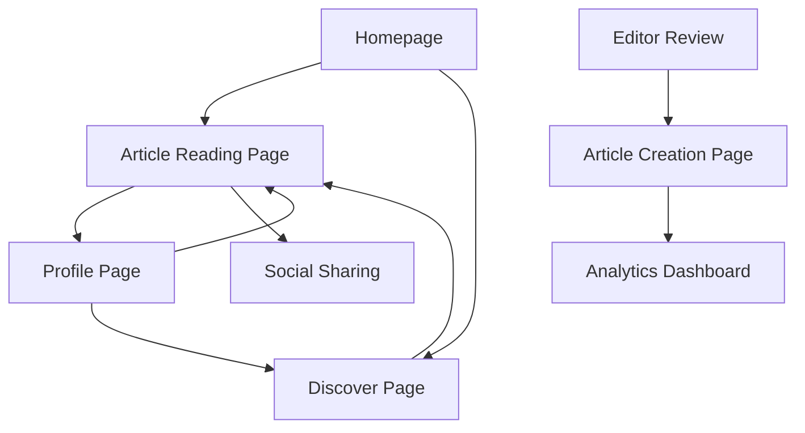

## 1. Product Overview

A premium long-form article publishing platform that combines Apple-inspired minimalist aesthetics with Medium-level readability and Lonely Planet depth of content. The platform enables content creators to craft immersive, multimedia-rich articles with exceptional user experience design, accessibility compliance, and performance optimization.

The platform solves the problem of generic, poorly-designed content experiences by providing a world-class reading environment that engages users through thoughtful design, interactive elements, and comprehensive content coverage while maintaining fast loading speeds and accessibility standards.

## 2. Core Features

### 2.1 User Roles

| Role | Registration Method | Core Permissions |
|------|---------------------|------------------|
| Reader | Email registration | Browse articles, save favorites, leave comments, share content |
| Content Creator | Application approval | Create/edit articles, access analytics, manage publication settings |
| Editor | Admin invitation | Review submissions, edit content, manage creator accounts |
| Admin | System setup | Full platform management, user management, analytics access |

### 2.2 Feature Module

Our long-form article platform consists of the following main pages:
1. **Homepage**: Featured articles, trending content, category navigation, newsletter signup
2. **Article Reading Page**: Full article content with premium reading experience, interactive elements
3. **Article Creation Page**: Rich text editor with multimedia integration, preview mode
4. **Profile Page**: User dashboard, saved articles, reading history, preferences
5. **Discover Page**: Search, filters, category browsing, personalized recommendations
6. **Analytics Dashboard**: Performance metrics, engagement data, audience insights

### 2.3 Page Details

| Page Name | Module Name | Feature description |
|-----------|-------------|---------------------|
| Homepage | Hero Section | Display featured article with full-bleed imagery, smooth fade-in animations, and compelling headline typography |
| Homepage | Article Grid | Masonry layout showcasing latest articles with hover effects, reading time indicators, and category tags |
| Homepage | Navigation Bar | Minimalist sticky navigation with smooth scroll behavior, search integration, and user profile access |
| Article Reading Page | Content Area | Premium typography with optimal line height (1.6-1.8), generous white space, and responsive column width |
| Article Reading Page | Progress Indicator | Visual reading progress bar with smooth animations and section navigation |
| Article Reading Page | Interactive Elements | Pull quotes with highlight effects, expandable sections, embedded quizzes, and calculators |
| Article Reading Page | Multimedia Integration | Full-bleed imagery with captions, video embeds, audio players, and interactive maps |
| Article Reading Page | Social Features | Share buttons, highlight and comment functionality, related articles recommendations |
| Article Creation Page | Rich Text Editor | WYSIWYG editor with markdown support, drag-and-drop media upload, and real-time preview |
| Article Creation Page | Media Library | Organized asset management with tagging, search, and optimization tools |
| Article Creation Page | Publishing Tools | SEO optimization, scheduling, category selection, and preview across devices |
| Profile Page | Reading History | Chronological reading list with progress tracking and resume functionality |
| Profile Page | Saved Articles | Bookmark management with folders, tags, and offline reading capabilities |
| Profile Page | Preferences | Reading mode selection, font size adjustment, theme customization |
| Discover Page | Search Functionality | Intelligent search with filters, autocomplete, and content suggestions |
| Discover Page | Category Browsing | Hierarchical category system with trending topics and editor picks |
| Discover Page | Recommendations | AI-powered content suggestions based on reading history and preferences |
| Analytics Dashboard | Performance Metrics | Article views, engagement rates, reading completion statistics |
| Analytics Dashboard | Audience Insights | Demographics, reading patterns, and content performance analysis |

## 3. Core Process

### Reader Flow
Users begin at the homepage where they can browse featured content or use the discover page to find articles matching their interests. The reading experience starts with a clean, distraction-free interface that adapts to their preferences. Interactive elements appear contextually, and progress is automatically saved. Users can highlight text, leave comments, and share content seamlessly.

### Content Creator Flow
Creators access the article creation interface with a powerful editor that supports rich media integration. They can preview their content across different devices, optimize for SEO, and schedule publication. Analytics provide real-time feedback on performance and audience engagement.

### Editor Flow
Editors review submitted content, provide feedback, and manage the editorial calendar. They can curate featured content and manage category organization.

## 4. User Interface Design

### 4.1 Design Style

**Primary Colors:**
- Background: #FFFFFF (pure white) with subtle gray variations (#F8F9FA, #E9ECEF)
- Text: #1A1A1A (near-black) for primary content, #6C757D for secondary text
- Accent: #007AFF (Apple blue) for interactive elements and CTAs

**Typography:**
- Headlines: SF Pro Display, 32-48px with 1.2 line height
- Body Text: SF Pro Text, 18-21px with 1.6-1.8 line height
- Captions: SF Pro Text, 14-16px with 1.4 line height

**Button Style:**
- Rounded corners (8-12px radius) with subtle shadows
- Hover states with 0.2s transition animations
- Primary actions in accent blue, secondary in subtle gray

**Layout Style:**
- Card-based design with generous padding (24-32px)
- Asymmetric grids for visual interest
- Full-bleed imagery with thoughtful cropping

**Icon Style:**
- SF Symbols for consistency with Apple ecosystem
- Outlined style with 2px stroke weight
- Subtle animations on interaction

### 4.2 Page Design Overview

| Page Name | Module Name | UI Elements |
|-----------|-------------|-------------|
| Homepage | Hero Section | Full-screen hero with parallax scrolling, gradient overlays, and animated text reveal |
| Homepage | Article Grid | Responsive masonry layout with lazy loading images and smooth hover transitions |
| Article Reading Page | Content Area | Optimal reading width (65-75 characters), generous margins, and sticky table of contents |
| Article Reading Page | Progress Bar | Thin animated progress indicator with section markers and completion percentage |
| Article Reading Page | Pull Quotes | Large, centered typography with subtle background highlighting and animation |
| Article Creation Page | Editor Interface | Clean toolbar with grouped actions, markdown shortcuts, and distraction-free writing mode |
| Profile Page | Dashboard | Card-based statistics with animated counters and interactive charts |
| Discover Page | Search Bar | Prominent search with instant results, filter chips, and recent searches |

### 4.3 Responsiveness

**Desktop-First Design:**
- Optimized for 1440px+ screens with maximum content width of 1200px
- Progressive enhancement for larger displays with enhanced typography and imagery
- Keyboard navigation support with visible focus indicators

**Mobile Adaptation:**
- Breakpoints at 768px and 480px with content-first approach
- Touch-optimized interactions with 44px minimum tap targets
- Simplified navigation with bottom tab bar on mobile devices
- Offline reading capabilities with service worker implementation

**Performance Optimization:**
- Critical CSS inlining for above-the-fold content
- Progressive image loading with blur-up technique
- Code splitting for optimal bundle sizes
- CDN integration for global content delivery

**Accessibility Compliance:**
- WCAG 2.1 AA standard compliance with proper ARIA labels
- High contrast mode support with alternative color schemes
- Screen reader optimization with semantic HTML structure
- Keyboard navigation support for all interactive elements