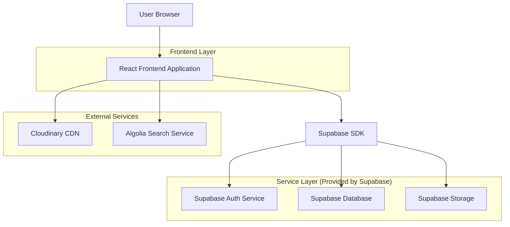
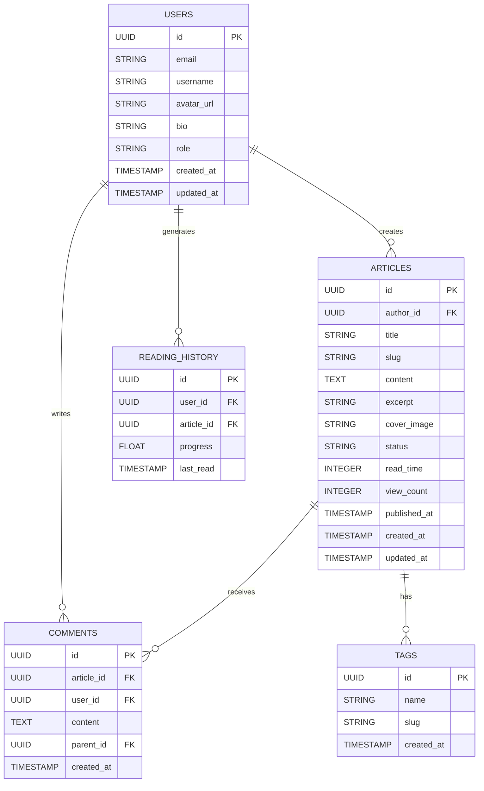

## 1. Architecture Design



## 2. Technology Description

**Frontend Stack:**
- React@18 with TypeScript for component-based architecture
- Tailwind CSS@3 for utility-first styling with custom design tokens
- Vite for fast development and optimized production builds
- Framer Motion for premium animations and micro-interactions
- React Query for efficient data fetching and caching

**Initialization Tool:**
- Vite-init for modern development experience with hot module replacement

**Backend Services:**
- Supabase for authentication, database, and file storage
- Cloudinary for optimized image delivery and transformations
- Algolia for advanced search functionality with instant results

**Development Tools:**
- ESLint and Prettier for code quality and formatting
- Husky for git hooks and pre-commit validation
- Jest and React Testing Library for unit testing

## 3. Route Definitions

| Route | Purpose |
|-------|---------|
| / | Homepage with featured articles and trending content |
| /article/:slug | Individual article reading experience with premium design |
| /create | Article creation interface with rich text editor |
| /discover | Content discovery with search and category browsing |
| /profile/:username | User profile with reading history and saved articles |
| /analytics | Performance dashboard for content creators |
| /login | User authentication with social login options |
| /register | Account creation with email verification |
| /settings | User preferences and account management |

## 4. API Definitions

### 4.1 Core API

**Article Management**
```
GET /api/articles
POST /api/articles
PUT /api/articles/:id
DELETE /api/articles/:id
```

**Request Parameters (GET /api/articles):**
| Param Name | Param Type | isRequired | Description |
|------------|------------|------------|-------------|
| category | string | false | Filter by category slug |
| limit | number | false | Number of articles to return (default: 20) |
| offset | number | false | Pagination offset |
| search | string | false | Search query string |

**Response (GET /api/articles):**
| Param Name | Param Type | Description |
|------------|------------|-------------|
| articles | array | Array of article objects |
| total | number | Total count of articles |
| hasMore | boolean | Indicates if more articles exist |

**User Authentication**
```
POST /api/auth/login
POST /api/auth/register
POST /api/auth/logout
GET /api/auth/me
```

**Request (POST /api/auth/login):**
| Param Name | Param Type | isRequired | Description |
|------------|------------|------------|-------------|
| email | string | true | User email address |
| password | string | true | User password |

**Response (POST /api/auth/login):**
| Param Name | Param Type | Description |
|------------|------------|-------------|
| user | object | User profile data |
| token | string | JWT authentication token |
| expiresIn | number | Token expiration time in seconds |

## 5. Data Model

### 5.1 Database Schema



### 5.2 Data Definition Language

**Users Table**
```sql
CREATE TABLE users (
  id UUID PRIMARY KEY DEFAULT gen_random_uuid(),
  email VARCHAR(255) UNIQUE NOT NULL,
  username VARCHAR(50) UNIQUE NOT NULL,
  password_hash VARCHAR(255) NOT NULL,
  avatar_url TEXT,
  bio TEXT,
  role VARCHAR(20) DEFAULT 'reader' CHECK (role IN ('reader', 'creator', 'editor', 'admin')),
  created_at TIMESTAMP WITH TIME ZONE DEFAULT NOW(),
  updated_at TIMESTAMP WITH TIME ZONE DEFAULT NOW()
);

-- Indexes for performance
CREATE INDEX idx_users_email ON users(email);
CREATE INDEX idx_users_username ON users(username);
```

**Articles Table**
```sql
CREATE TABLE articles (
  id UUID PRIMARY KEY DEFAULT gen_random_uuid(),
  author_id UUID REFERENCES users(id) ON DELETE CASCADE,
  title VARCHAR(255) NOT NULL,
  slug VARCHAR(255) UNIQUE NOT NULL,
  content TEXT NOT NULL,
  excerpt TEXT,
  cover_image TEXT,
  status VARCHAR(20) DEFAULT 'draft' CHECK (status IN ('draft', 'published', 'archived')),
  read_time INTEGER DEFAULT 0,
  view_count INTEGER DEFAULT 0,
  published_at TIMESTAMP WITH TIME ZONE,
  created_at TIMESTAMP WITH TIME ZONE DEFAULT NOW(),
  updated_at TIMESTAMP WITH TIME ZONE DEFAULT NOW()
);

-- Indexes for performance
CREATE INDEX idx_articles_author ON articles(author_id);
CREATE INDEX idx_articles_status ON articles(status);
CREATE INDEX idx_articles_published ON articles(published_at DESC);
CREATE INDEX idx_articles_slug ON articles(slug);
```

**Comments Table**
```sql
CREATE TABLE comments (
  id UUID PRIMARY KEY DEFAULT gen_random_uuid(),
  article_id UUID REFERENCES articles(id) ON DELETE CASCADE,
  user_id UUID REFERENCES users(id) ON DELETE CASCADE,
  content TEXT NOT NULL,
  parent_id UUID REFERENCES comments(id) ON DELETE CASCADE,
  created_at TIMESTAMP WITH TIME ZONE DEFAULT NOW()
);

-- Indexes for performance
CREATE INDEX idx_comments_article ON comments(article_id);
CREATE INDEX idx_comments_user ON comments(user_id);
CREATE INDEX idx_comments_parent ON comments(parent_id);
```

**Reading History Table**
```sql
CREATE TABLE reading_history (
  id UUID PRIMARY KEY DEFAULT gen_random_uuid(),
  user_id UUID REFERENCES users(id) ON DELETE CASCADE,
  article_id UUID REFERENCES articles(id) ON DELETE CASCADE,
  progress FLOAT DEFAULT 0 CHECK (progress >= 0 AND progress <= 1),
  last_read TIMESTAMP WITH TIME ZONE DEFAULT NOW(),
  UNIQUE(user_id, article_id)
);

-- Indexes for performance
CREATE INDEX idx_reading_history_user ON reading_history(user_id);
CREATE INDEX idx_reading_history_article ON reading_history(article_id);
CREATE INDEX idx_reading_history_last_read ON reading_history(last_read DESC);
```

### 5.3 Row Level Security Policies

**Articles Security**
```sql
-- Allow anonymous users to read published articles
CREATE POLICY "Published articles are viewable by everyone" ON articles
  FOR SELECT USING (status = 'published');

-- Allow creators to manage their own articles
CREATE POLICY "Users can manage their own articles" ON articles
  FOR ALL USING (auth.uid() = author_id);

-- Allow editors to manage all articles
CREATE POLICY "Editors can manage all articles" ON articles
  FOR ALL USING (EXISTS (
    SELECT 1 FROM users WHERE id = auth.uid() AND role IN ('editor', 'admin')
  ));
```

**Comments Security**
```sql
-- Allow all users to read comments
CREATE POLICY "Comments are viewable by everyone" ON comments
  FOR SELECT USING (true);

-- Allow users to create comments
CREATE POLICY "Authenticated users can create comments" ON comments
  FOR INSERT WITH CHECK (auth.uid() = user_id);

-- Allow users to delete their own comments
CREATE POLICY "Users can delete their own comments" ON comments
  FOR DELETE USING (auth.uid() = user_id);
```

## 6. Performance Optimization

### 6.1 Image Optimization
- Cloudinary integration for automatic format conversion (WebP/AVIF)
- Responsive image sizing with srcset implementation
- Lazy loading with blur-up placeholder technique
- Progressive JPEG for large hero images

### 6.2 Content Delivery
- CDN integration for static assets
- Service worker implementation for offline reading
- Critical CSS inlining for above-the-fold content
- Code splitting with route-based chunks

### 6.3 Database Optimization
- Indexed columns for frequent queries
- Materialized views for complex analytics
- Connection pooling for concurrent users
- Query result caching with Redis (optional scaling)

## 7. Security Considerations

### 7.1 Authentication Security
- JWT tokens with secure storage and refresh mechanisms
- Rate limiting for login attempts and API endpoints
- Email verification for new accounts
- Two-factor authentication support

### 7.2 Content Security
- XSS protection with content sanitization
- CSRF protection for state-changing operations
- SQL injection prevention through parameterized queries
- File upload restrictions and virus scanning

### 7.3 Privacy Compliance
- GDPR compliance with data export and deletion
- Cookie consent management
- Analytics anonymization
- Secure data transmission with HTTPS